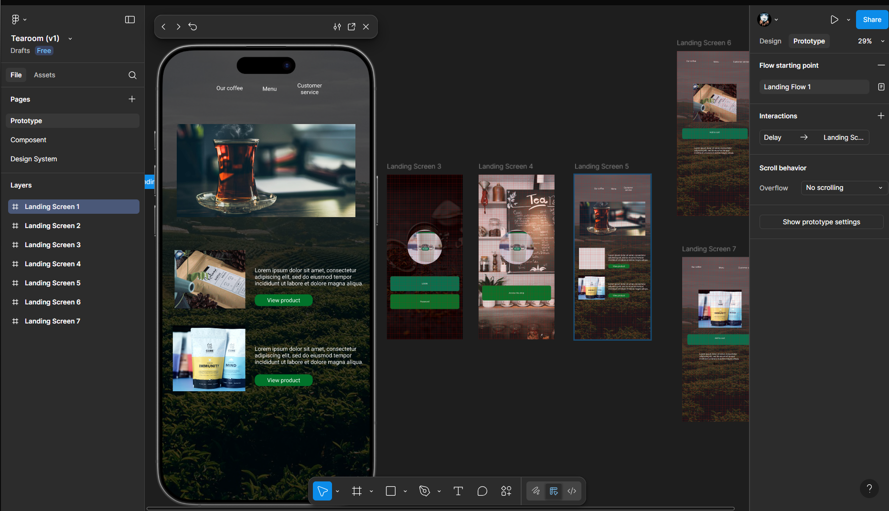
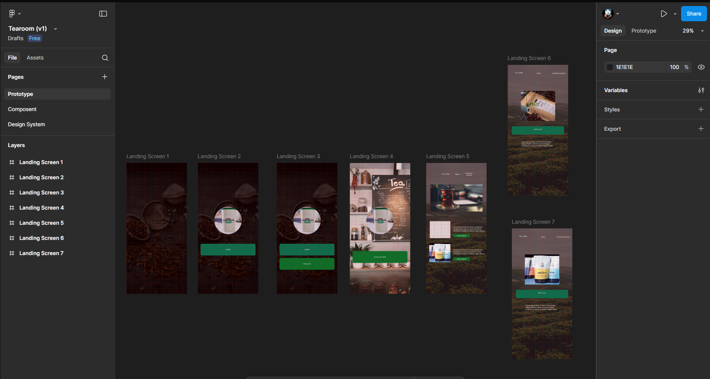
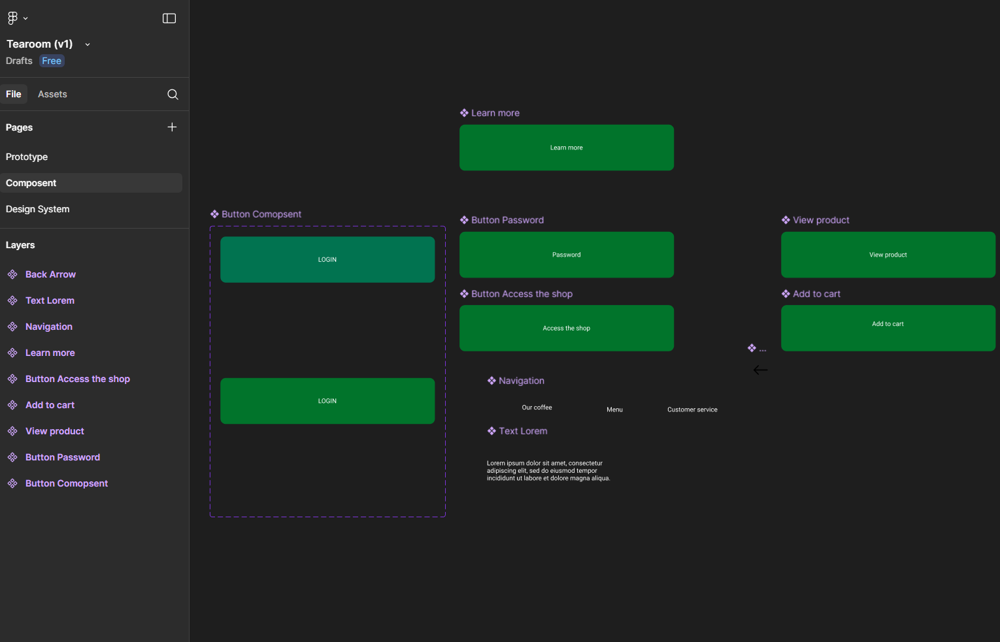
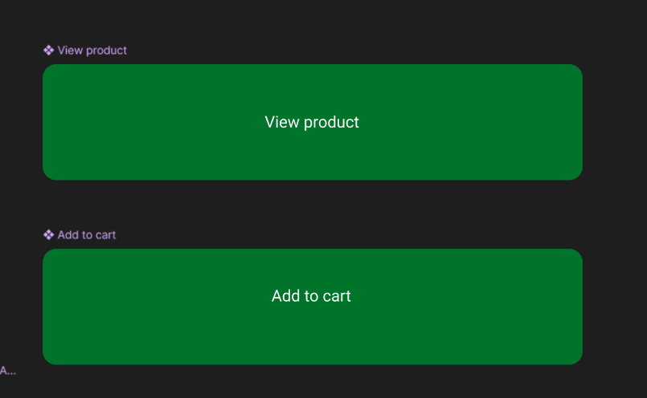

# Réponses TP1

## 1. Besoin utilisateur

Un besoin utilisateur, c’est ce que la personne veut vraiment faire avec l’interface.  
Dans mon projet, le besoin principal est simple : pouvoir découvrir et acheter du thé facilement, sans se perdre dans l’interface.

## 2. Processus UCD

Le Design Centré Utilisateur suit 4 étapes :

1. Comprendre le contexte et les utilisateurs
2. Définir les besoins et les contraintes
3. Concevoir et prototyper
4. Tester et améliorer

Aujourd’hui je suis entre l’étape **Conception/Prototypage** et **Test** : j’ai fait des wireframes, je les ai transformés en maquettes dans Figma, et j’ai demandé à des personnes proches ce qu’il faudrait améliorer.

## 3. Observateurs dans Figma

J’ai ajouté un observateur sur mon Figma.  
Ça permet d’avoir des retours rapides, de voir si mes choix sont bons, et de corriger plus tôt.  
C’est dans l’esprit UCD.

## 4. Calques

Dans Figma, chaque élément est un calque.  
Pour garder ça propre, je :

- renomme tout ce que je mets (`Landing_Screen` au lieu de `Frame1`),
- organise avec des frames dans l’ordre pour que je m’y retrouve,
- verrouille ce qui ne doit pas bouger.

## 5. Composants

J’ai créé des composants pour ce qui revient souvent : une navigation pour chaque écran, des boutons (“Add to cart”, “Password button”) pour les actions.

## 6. Boutons (primaire, secondaire, tertiaire)

J’ai défini trois types de boutons dans mon projet :

- **Primaire** : “Add to cart” → c’est l’action principale.
- **Secondaire** : “View details” → utile mais moins important.
- **Tertiaire** : “Filter teas” → optionnel et plus discret.

Tous ont des états différents (normal, hover, actif, désactivé) pour donner un retour visuel.

## 7. Wayfinding

Pour que l’utilisateur sache toujours où il est :

- j’ai une navigation en haut de page qui montre la page active,
- chaque écran a un titre clair,
- quand on clique sur un produit, on peut revenir en arrière facilement.

## 8. Affordance d’un bouton

Mes boutons ont une forme simple et reconnaissable, avec des couleurs qui contrastent avec le fond.  
Le texte est clair (“View product”, “Access the shop”) et l’apparence change quand on clique ou qu’on passe la souris dessus.  
Ça donne envie de cliquer sans se poser de questions.

## 9. Points à améliorer

Les points à ajuster dépendront des retours qu’on me fera.  
Mon but est de rendre Tearoom le plus simple et intuitif possible, tout en restant agréable à utiliser.

## Captures Figma

Lien de mon travail https://www.figma.com/design/299uWY02y22lggfGEvj9v5/Tearoom--v1-?node-id=0-1&p=f&t=a83b1CZGhoJ6yjTq-0
